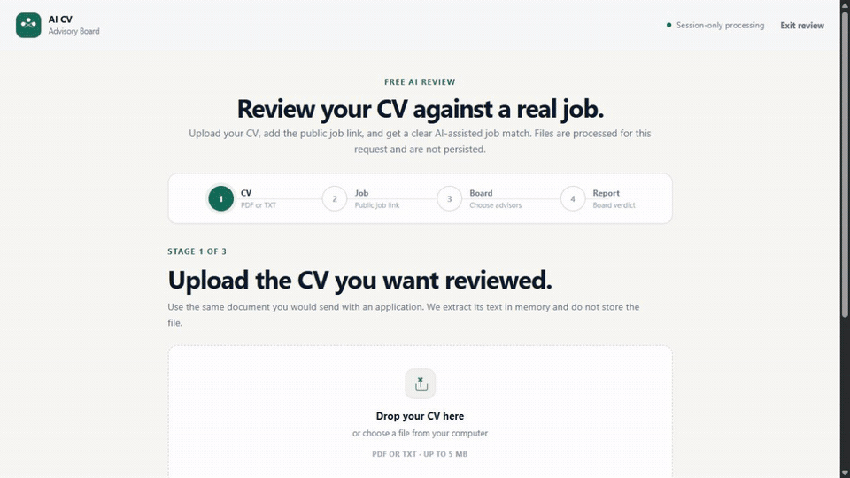
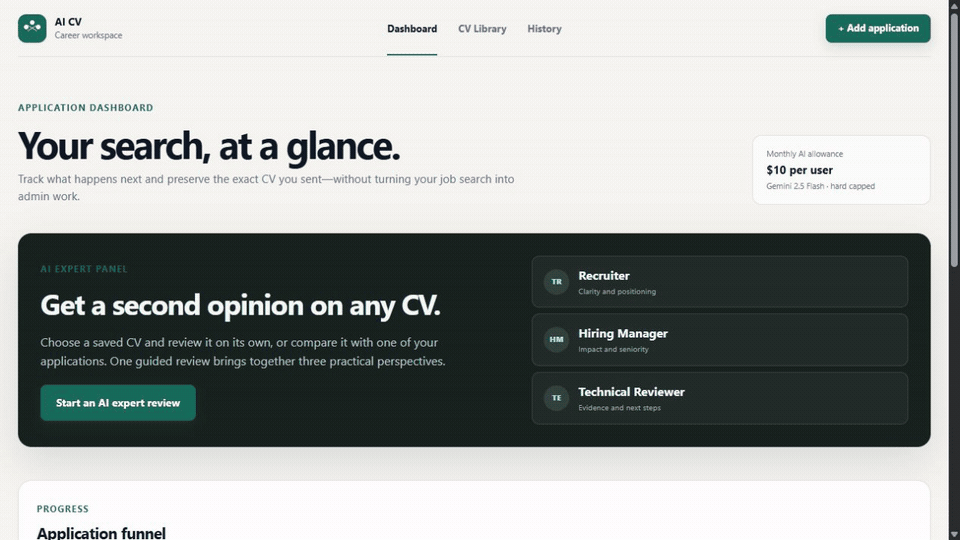
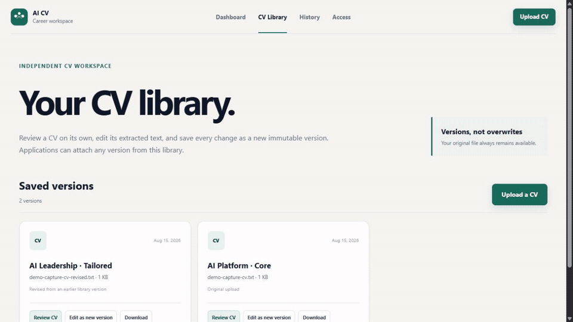

# AI CV Advisory Board — Production Edition

A spec-first reconstruction of the AI CV Advisory Board. The repository is intended to demonstrate not only a product, but a repeatable engineering process: explicit requirements, architectural decisions, threat modeling, deterministic evaluation, automated tests, observability, and browser-level regression evidence.

The product has two access tiers: a no-login, session-only Gemini review backed by one shared monthly USD 5 hard cap, and an administrator-approved private workspace with a USD 10 monthly AI allowance per member. Both tiers share a USD 50 project emergency ceiling. See [Spec 008](docs/specs/008-tiered-access.md).

The private workspace now treats CVs as independent, versioned assets: members can review a CV without an application, edit extracted text into a new immutable version, and later compare an attached version against a tracked role. See [Spec 009](docs/specs/009-cv-library-and-navigation.md).

The free review now restores the advisory-board experience from the Streamlit prototype without restoring its multi-call cost: users select up to three specialists, one bounded Gemini call produces the complete grounded report, and the UI presents advisor verdicts, safe tailoring moves, and interview preparation. See [Spec 015](docs/specs/015-free-advisory-board-experience.md).

An entire application search can be archived before starting fresh. Active applications and CV versions move together into owner-scoped, read-only History, where members can inspect past applications, see attached CV versions, and download the original files without changing the active workspace. See [Spec 014](docs/specs/014-workspace-history.md).

The application dashboard now leads with a plain-language AI Expert Panel, while a verified HTTP-only session keeps members signed in across Dashboard, CV Library, and Access. See [Spec 010](docs/specs/010-expert-panel-and-session.md).

Browser-facing security is enforced at the HTTP boundary with same-origin write checks, hardened session cookies, private-response cache controls, CSP, HSTS, and related response protections. See [Spec 011](docs/specs/011-browser-security-guardrails.md).

## Product demo

These walkthroughs are captured from the real application with synthetic career data. They use the deterministic local reviewers, so they expose no personal CV and consume no paid AI allowance.

### Free advisory-board review

Upload a CV, compare it with a role, read the evidence match, and move through the selected specialist panel, safe tailoring actions, interview preparation, and the requirement ledger.

[](https://ai-cv-advisory-board-production-142795288331.us-central1.run.app/workspace)

### Application tracker and AI expert panel

Track applications through the funnel, focus on a pipeline stage, preserve the CV version used for each role, and ask the three-lens expert panel for a second opinion.

[](https://ai-cv-advisory-board-production-142795288331.us-central1.run.app/dashboard)

### CV library and immutable revisions

Review a CV independently, inspect its strengths and gaps, edit the extracted content, and save the result as a new version without overwriting the original.

[](https://ai-cv-advisory-board-production-142795288331.us-central1.run.app/cvs)

The capture contract and privacy constraints are documented in [Spec 016](docs/specs/016-readme-product-demos.md).

## Current vertical slice

- Track applications in an interactive Interested → Applied → Interviewing → Offer → Closed pipeline.
- Filter with a live application funnel and move cards with drag-and-drop or an accessible status control.
- Upload immutable CV versions and attach the exact version sent to each application.
- Record job links, next actions, and notes without requiring AI.
- Upload a PDF/TXT CV or use a deliberate text fallback.
- Add a public HTTPS job posting or paste the description when the page cannot be read.
- Receive a deterministic, explainable CV–job match assessment.
- See matched requirements, evidence gaps, and safe recommendations.
- Use a synthetic demo without an API key.
- Export a JSON result carrying schema and scoring versions.
- Use Gemini 2.5 Flash for bounded structured evidence reviews in production.
- Enforce shared $5 anonymous, $10 member, and $50 project ceilings using atomic pre-call reservations.
- Run unit, security, integration, evaluation, and Playwright browser tests without paid services.
- Recover from file parsing and job-page failures without re-entering the entire review.

The deterministic engine remains the offline baseline. Production Gemini calls sit behind the same typed contract,
strict JSON schema, minimal thinking, a 1,024-token output ceiling, and a durable Firestore cost ledger. No score
is presented as a simulation of a commercial ATS.

## Engineering trail

1. [Product specification](docs/specs/001-product.md)
2. [Architecture specification](docs/specs/002-architecture.md)
3. [Quality and evaluation specification](docs/specs/003-quality-evaluation.md)
4. [Advisory workspace interface specification](docs/specs/004-interface-redesign.md)
5. [Product interface recovery specification](docs/specs/005-product-interface-recovery.md)
6. [Document-first review specification](docs/specs/006-document-first-review.md)
7. [Career pipeline specification](docs/specs/007-career-pipeline.md)
8. [Tiered access specification](docs/specs/008-tiered-access.md)
9. [CV library and navigation specification](docs/specs/009-cv-library-and-navigation.md)
10. [Expert panel and persistent session specification](docs/specs/010-expert-panel-and-session.md)
11. [Browser security guardrails](docs/specs/011-browser-security-guardrails.md)
12. [AI cost and abuse guardrails](docs/specs/013-ai-cost-and-abuse-guardrails.md)
13. [Workspace history](docs/specs/014-workspace-history.md)
14. [Free advisory-board experience](docs/specs/015-free-advisory-board-experience.md)
15. [README product demos](docs/specs/016-readme-product-demos.md)
16. [Threat model](docs/THREAT_MODEL.md)
17. [Operations and observability](docs/OPERATIONS.md)
18. [ADR 001: deterministic baseline first](docs/adr/001-deterministic-baseline.md)

## Local setup

```bash
python -m venv .venv
.venv/Scripts/activate
pip install -e ".[dev]"
playwright install chromium
uvicorn src.advisory.web:app --reload
```

Open `http://127.0.0.1:8000`.

Local mode uses explicit in-memory adapters and a development identity. Production uses Google ID-token
verification, Firestore, a private Cloud Storage bucket, Vertex AI, and Application Default Credentials.

## Quality gates

```bash
ruff check .
mypy
pytest
python -m evals.runner
pytest tests_e2e --override-ini='testpaths=tests_e2e' --no-cov -q
```

## Deployment target

Google Cloud project: `ai-cv-advisory-board`. The container is designed for Cloud Run and listens on `$PORT`.

- Production service: https://ai-cv-advisory-board-production-142795288331.us-central1.run.app
- Production health endpoint: https://ai-cv-advisory-board-production-142795288331.us-central1.run.app/api/health
- Region: `us-central1`
- Cloud Run service: `ai-cv-advisory-board-production`
- Initial production revision: `ai-cv-advisory-board-production-00001-6tc`
